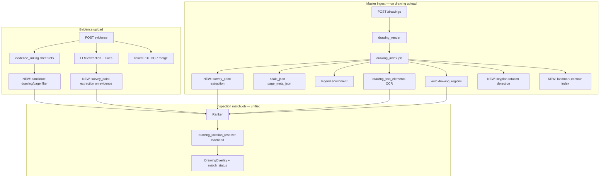

# Master Drawing Auto-Index + Survey-Grade Location Resolution Plan

**Document version:** 2.0 (hybrid)  
**Supersedes:** `Notes/Master Drawing Auto-Index Implementation Plan.md` (Phases 0–8 only)  
**Golden regression case:** Project `2`, master drawing `661`, inspection run `435`, evidence `357`, linked install sheet `C4.20`, Utility MR (NPC-5) sanitary sewer corridor near Future Hospital Building.

---

## 1. Problem statement

### 1.1 What works today (Phases 0–8 — largely implemented)

| Component | File(s) | Status |
|-----------|---------|--------|
| OCR index job | `backend/services/drawing_index_jobs.py`, `backend/ai/pipelines/master_drawing_indexer.py` | Implemented |
| `drawing_text_elements` table | `backend/models/drawing_text_element.py` | Implemented |
| Scale parser | `backend/ai/pipelines/drawing_scale_parser.py` | Implemented |
| Legend tagger | `backend/services/master_drawing_legend_tagger.py` | Implemented |
| Auto regions | `backend/ai/pipelines/master_drawing_region_builder.py` | Implemented |
| Clue tile matcher | `backend/ai/pipelines/candidate_tile_selector.py` | Implemented |
| Inspection match job | `backend/services/inspection_matching_jobs.py` | Implemented |
| Index API/UI | `backend/services/drawing_index_api.py`, `client/src/lib/api/drawing_index.ts` | Implemented |
| Location resolver (Case A/B) | `backend/ai/pipelines/drawing_location_resolver.py` | Implemented but **not wired into `inspection_match` job** |

### 1.2 Why run #435 failed (`no_match`)

1. **`inspection_match` job searches master drawing 661 only** — rich station/N/E data lives on linked sheet C4.20 OCR text, not in master's indexed tiles.
2. **Clue matcher is substring-only** — `"SS"` / `"sanitary sewer"` on a campus site plan is ambiguous; no coordinate anchor.
3. **`RegistrationTransform.apply()` ignores `rotation_degrees`** — upside-down sheets break geometric compare.
4. **Sheet refs extracted but not used for matching** — `evidence_linking.py` links C4.20; resolver explicitly drops `SHEET_IDENTIFIER` terms.
5. **Two parallel pipelines not unified** — `inspection_mapping.py` uses `drawing_location_resolver`; `inspection_matching_jobs.py` uses `candidate_tile_selector` only.

### 1.3 Goal

On evidence upload, automatically place inspection location on the master drawing using the same signals a human uses. **All applicable methods run; the highest `internal_score` wins** (§13d). Signal reliability order below is **tie-break only** when scores are within `0.01`:

1. **N/E survey coordinates** (strongest — rotation-invariant)
2. **Inspection type + location term** (existing Case B)
3. **Geometric alignment after true-north normalization** (fixed Case A)
4. **Landmark contour fingerprint** (fallback when coords fail)
5. **Sheet cross-refs** — not a resolver method; **narrows candidate drawings/pages before steps 1–4**

---

## 2. Target architecture



**Coordinate system everywhere:** normalized fractional bbox `{x0, y0, x1, y1}` in range `[0.0, 1.0]`, origin top-left, x right, y down — same as `document_text_extraction.BoundingBox.to_fractional()`.

---

## Part I — Master Drawing Auto-Index (Phases 0–8)

> **Implementation status:** Complete in codebase. Retained here as reference for Phase 9+ dependencies. Do not re-implement unless a test fails.

### Phase 0 — Data model & config

#### 0a. `drawing_text_elements` (exists)

```python
# backend/models/drawing_text_element.py — DO NOT CHANGE SCHEMA for Phase 9
master_drawing_id: int  # FK drawings.id
page: int               # 1-based
text: str
text_normalized: str    # lower/strip
bbox_json: {"x0","y0","x1","y1"}  # normalized 0–1
ocr_confidence: float   # default 1.0
legend_expansion: str | None
legend_codes_json: list[str] | None
source: "native_pdf" | "tesseract" | "openai_vision"
```

Indexes: `(master_drawing_id)`, `(master_drawing_id, page)`, `(text_normalized)`.

#### 0b. `drawings.scale_json` and `drawings.page_meta_json` (exists)

```python
scale_json = {
    "raw_text": "1\" = 10'",
    "paper_inches_per_real_foot": 0.1,      # 1 inch paper / 10 feet real
    "real_feet_per_paper_inch": 10.0,
    "horizontal": {"numerator": 1, "denominator": 10, "units": "in=ft"},
    "confidence": float,                     # 0.0–1.0
    "source_bbox": [x0, y0, x1, y1],
    "page": 1,
}

page_meta_json = [{
    "page": 1,
    "width_pt": float,    # PDF MediaBox width in points (72 pt = 1 inch)
    "height_pt": float,
    "width_px": int,      # from DrawingRendition
    "height_px": int,
    "rotation": int,      # PyMuPDF page.rotation — PDF box rotation ONLY (0|90|180|270)
    # Phase 9 adds:
    # "true_north_rotation_deg": float,   # keyplan-detected, see Phase 11
    # "true_north_source": str,           # "keyplan_cv" | "orientation_text" | "pdf_rotation" | "manual"
    # "keyplan_bbox": [x0, y0, x1, y1],
}]
```

Physical size conversion (existing, use in contour step):

```python
real_width_ft = normalized_width * (width_pt / 72.0) * scale_json["real_feet_per_paper_inch"]
```

#### 0c. Index status on `drawings` (exists)

```python
index_status: "pending" | "processing" | "ready" | "failed"
index_error: str | None
indexed_at: datetime | None
index_stats_json: {
    "pages": int,
    "text_elements": int,
    "regions": int,
    "scale_found": bool,
    # Phase 9 adds:
    "survey_points": int,
    "landmarks": int,
    "keyplan_detected_pages": int,
}
```

#### 0d. Config (`backend/config.py` — exists)

| Env var | Default | Meaning |
|---------|---------|---------|
| `DRAWING_INDEX_ENABLED` | `true` | Skip index jobs when false |
| `DRAWING_INDEX_TILE_SIZE_NORMALIZED` | `0.08` | Grid tile size (8% of page) |
| `DRAWING_INDEX_MIN_CLUSTER_WORDS` | `2` | Min words per OCR cluster |
| `DRAWING_INDEX_OCR_MAX_PAGES` | `0` | `0` = all pages |
| `DRAWING_INDEX_AUTO_REGION_MODE` | `cluster` | `cluster` \| `grid` \| `hybrid` |

Region builder constants (do not change without updating tests):

| Constant | Value | File |
|----------|-------|------|
| `_MIN_OCR_CONFIDENCE` | `0.5` | `master_drawing_region_builder.py` |
| `_CLUSTER_BUCKET_SIZE` | `0.04` | same |
| `_FIXED_GRID_DIVISIONS` | `12` | same |
| `TITLE_BLOCK_X_MIN` | `0.75` | `drawing_scale_parser.py` |
| `TITLE_BLOCK_Y_MIN` | `0.75` | same |
| `_BBOX_OVERLAP_THRESHOLD` | `0.5` | `candidate_tile_selector.py` |
| `MATCH_SCORE_THRESHOLD` | `0.75` | `inspection_match_persistence.py` |
| `LINKED_CONTENT_WORD_BUDGET` | `6000` words | `linked_attachment_merge.py` |

---

### Phase 1 — `drawing_index` job (exists)

- **Enqueue:** chained after `drawing_render` completes (`drawing_index_jobs.py`).
- **Idempotency:** delete all `drawing_text_elements` for drawing; delete only regions where `geometry.meta.source == "auto_index"`; preserve human-drawn regions.
- **Phase 9 extension:** also delete/replace `drawing_survey_points` and `drawing_landmarks` where `source == "auto_index"`.

---

### Phase 2 — OCR ingest (exists)

Module: `backend/ai/pipelines/master_drawing_indexer.py`

Pipeline: `open_storage_path` → `extract_document()` → bulk insert `DrawingTextElement` → legend enrich → auto regions → persist scale/page_meta.

---

### Phase 3 — Scale extraction (exists)

Module: `backend/ai/pipelines/drawing_scale_parser.py`

Title-block scan region: `x >= 0.75 AND y >= 0.75` on page 1 first; fallback full page.

---

### Phase 4 — Legend enrichment (exists)

Module: `backend/services/master_drawing_legend_tagger.py`

Uses `scripts/seed_legend_reference.py` + `backend/data/legend_seed_data.py`.

---

### Phase 5 — Auto regions (exists)

Module: `backend/ai/pipelines/master_drawing_region_builder.py`

Modes: `cluster` (bucket `0.04`), `grid` (`12×12`), `hybrid`.

---

### Phase 6 — Clue matching (exists, extend in Phase 13)

Module: `backend/ai/pipelines/candidate_tile_selector.py`

Priority: text elements → regions → dedupe by overlap ≥ `0.5`.

Score formula (existing):

```python
internal_score = tile.confidence + max(matched_clue.confidence)
# tile.confidence: 0.75 if tagged region, 0.50 untagged, 1.0 for direct text element match
# matched → status "matched" if internal_score >= 0.75
```

---

### Phase 7 — API & UI (exists)

| Endpoint | Purpose |
|----------|---------|
| `GET /projects/{pid}/drawings/{id}/index-status` | Status + stats |
| `POST /projects/{pid}/drawings/{id}/reindex` | Manual reindex |
| `GET /projects/{pid}/drawings/{id}/text-elements?page=&limit=` | Debug OCR |
| Phase 9 adds: `GET .../survey-points`, `GET .../landmarks` | Debug survey index |

UI: index spinner, stats line, distinguish `index_pending` vs `no_match`.

**UI fix (Phase 14 — required for run #435):**

- Poll `GET /inspections/{evidence_id}/match-status` every `2000 ms` until status ∉ `{index_pending}` or `30` attempts (60 s max).
- Pass **evidence id** (357), not run id (435), to match-status endpoint.
- Refetch overlays when job completes.

---

### Phase 8 — Tests (exists)

| Test file | Covers |
|-----------|--------|
| `test_drawing_scale_parser.py` | Scale regex |
| `test_master_drawing_indexer.py` | OCR persist |
| `test_master_drawing_legend_tagger.py` | SS expansion |
| `test_master_drawing_region_builder.py` | Auto regions |
| `test_candidate_tile_selector.py` | Text element match |
| `test_upload_drawing_enqueues_index_job.py` | Upload chain |
| `test_master_drawing_index_e2e.py` | Integration |

---

## Part II — Survey-Grade Location Resolution (Phases 9–14)

### Phase 9 — Survey point extraction & coordinate matching

**Priority:** Highest. Rotation-invariant. Implements user step **#1 (N/E coordinate OCR as first-class match key)**.

#### 9a. New table: `drawing_survey_points`

```python
# backend/models/drawing_survey_point.py
class DrawingSurveyPoint(Base):
    __tablename__ = "drawing_survey_points"

    id: int PK
    drawing_id: int FK drawings.id ON DELETE CASCADE
    page: int                          # 1-based
    northing: float                    # state-plane feet, 6–8 digits + decimals
    easting: float
    station: str | None                # e.g. "10+05.00"
    structure_label: str | None        # e.g. "SSMH", "MH-1", "CO"
    label_bbox_json: dict              # bbox of combined label cluster {x0,y0,x1,y1}
    northing_bbox_json: dict | None
    easting_bbox_json: dict | None
    ocr_confidence: float              # min(confidence of N token, E token)
    source: str                        # "auto_index" | "evidence_extract" | "manual"
    meta_json: dict | None             # raw OCR tokens, pairing_distance_ft, scale_fallback flag
    created_at: datetime
```

Indexes: `(drawing_id, page)`, `(northing, easting)` — use application-level tolerance query, not exact index equality.

#### 9b. Extraction module

**New file:** `backend/ai/pipelines/survey_point_extractor.py`

**Input:** `list[PositionedWord]` or `list[DrawingTextElement]` for one page, plus **`scale_json`** and **`page_meta_json`** for that page (required for pairing gates).

**Why physical feet, not normalized fractions:** A fixed normalized gap (e.g. `0.15` page width) represents ~600 ft on a `1"=40'` site plan but ~15 ft on a `1"=1'-0"` detail. Pairing gates must be in **real-world feet on the sheet** using `real_feet_per_paper_inch` from `scale_json`, not page fractions.

**Regex patterns (compile once):**

```python
# Northing — California State Plane feet (UCSF observed: 2131764.84)
_NORTHING_RE = re.compile(
    r"\bN\s*(?:=|:)?\s*(\d{6,8}(?:\.\d{1,2})?)\b",
    re.IGNORECASE,
)

# Easting — observed: 6051541.82
_EASTING_RE = re.compile(
    r"\bE\s*(?:=|:)?\s*(\d{6,8}(?:\.\d{1,2})?)\b",
    re.IGNORECASE,
)

# Station — e.g. 10+05, 10+05.00, STA 10+05
_STATION_RE = re.compile(
    r"\b(?:STA\.?\s*)?(\d{1,2}\+\d{2}(?:\.\d{1,2})?)\b",
    re.IGNORECASE,
)

# Structure labels near coords
_STRUCTURE_RE = re.compile(
    r"\b(SSMH|SSMH-\d+|MH-?\d+|CO-?\d+|SMH|DMH|CB|DI)\b",
    re.IGNORECASE,
)
```

**Physical distance helpers (use on every pairing decision):**

```python
POINTS_PER_INCH = 72.0

# Pairing gates — real-world feet on the sheet (not normalized fractions)
NE_PAIR_MAX_DISTANCE_FT = 15.0        # hard reject N↔E pairing beyond this
NE_PAIR_HORIZONTAL_MAX_FT = 12.0      # N and E usually on same line (side-by-side)
NE_PAIR_VERTICAL_MAX_FT = 8.0         # or stacked on adjacent lines
STATION_ATTACH_MAX_FT = 25.0          # station callout may sit slightly farther
STRUCTURE_ATTACH_MAX_FT = 25.0        # SSMH/MH label near coordinate block

# Fallback when scale unknown (low confidence or missing)
SCALE_FALLBACK_REAL_FEET_PER_PAPER_INCH = 10.0  # UCSF campus default; log warning

def normalized_delta_to_feet(
    dx_norm: float,
    dy_norm: float,
    *,
    page_width_pt: float,
    page_height_pt: float,
    real_feet_per_paper_inch: float,
) -> tuple[float, float]:
    """Convert centroid delta in normalized page coords to feet on the ground."""
    page_width_in = page_width_pt / POINTS_PER_INCH
    page_height_in = page_height_pt / POINTS_PER_INCH
    dx_ft = abs(dx_norm) * page_width_in * real_feet_per_paper_inch
    dy_ft = abs(dy_norm) * page_height_in * real_feet_per_paper_inch
    return dx_ft, dy_ft

def pairing_distance_ft(
    ax: float, ay: float, bx: float, by: float,
    *, page_meta: dict, scale_json: dict | None,
) -> float:
    dx_norm = bx - ax
    dy_norm = by - ay
    real_feet_per_in = float(
        (scale_json or {}).get("real_feet_per_paper_inch")
        or SCALE_FALLBACK_REAL_FEET_PER_PAPER_INCH
    )
    dx_ft, dy_ft = normalized_delta_to_feet(
        dx_norm, dy_norm,
        page_width_pt=float(page_meta["width_pt"]),
        page_height_pt=float(page_meta["height_pt"]),
        real_feet_per_paper_inch=real_feet_per_in,
    )
    return math.hypot(dx_ft, dy_ft)
```

**Pairing algorithm (deterministic):**

For each page, collect token matches with bboxes. Use token **centroids** in normalized space for distance, but evaluate all gates in **feet** via `pairing_distance_ft()`.

1. For each `N` token at centroid `(n_x, n_y)` with value `n_val`:
2. Find `E` token candidates where **both** hold (using `page_meta` + `scale_json` for this page):
   - `dx_ft, dy_ft = normalized_delta_to_feet(n_x - e_x, n_y - e_y, ...)`
   - `dx_ft <= NE_PAIR_HORIZONTAL_MAX_FT` (12.0 ft)
   - `dy_ft <= NE_PAIR_VERTICAL_MAX_FT` (8.0 ft)
   - `pairing_distance_ft(n, e, ...) <= NE_PAIR_MAX_DISTANCE_FT` (15.0 ft)
3. If multiple E candidates pass gates, pick minimum `pairing_distance_ft` (feet, not normalized).
4. Reject pair if no E candidate within `NE_PAIR_MAX_DISTANCE_FT`.
5. Attach nearest `_STATION_RE` token where `pairing_distance_ft(n, station) <= STATION_ATTACH_MAX_FT` (25.0 ft).
6. Attach nearest `_STRUCTURE_RE` token where `pairing_distance_ft(n, structure) <= STRUCTURE_ATTACH_MAX_FT` (25.0 ft).
7. `ocr_confidence = min(n_conf, e_conf)`.
8. Reject point if `ocr_confidence < 0.40`.

Store `meta_json.pairing_distance_ft` (feet) on each persisted survey point for debugging.

**Scale missing / low confidence:** if `scale_json is None` or `scale_json["confidence"] < 0.50`, use `SCALE_FALLBACK_REAL_FEET_PER_PAPER_INCH = 10.0` and set `meta_json.scale_fallback = true`. Do **not** fall back to normalized-fraction gates.

**Output:** `list[SurveyPointRecord]`.

#### 9c. Coordinate match algorithm

**New file:** `backend/ai/pipelines/survey_point_matcher.py`

```python
COORD_MATCH_TOLERANCE_FT = 3.0       # default match
COORD_MATCH_HIGH_CONF_FT = 1.0       # high confidence
COORD_MATCH_REJECT_FT = 5.0          # no match above this

def euclidean_survey_distance_ft(a: SurveyPoint, b: SurveyPoint) -> float:
    return math.hypot(a.northing - b.northing, a.easting - b.easting)

def match_survey_points(
    evidence_points: list[SurveyPoint],
    master_points: list[SurveyPoint],
) -> list[SurveyPointMatch]:
    """
    Greedy 1:1 assignment (v1): for each evidence point (sorted by ocr_confidence desc),
    assign best unmatched master point with distance <= COORD_MATCH_TOLERANCE_FT.
    Returns the single best-scoring match for overlay placement; additional pairs
    are optional audit rows only.
    """
```

**Known simplification (v1 — acceptable for now):**

Greedy nearest-first assignment is **not globally optimal**. With 5+ survey points clustered tightly (e.g. a manhole run with several SSMHs within a few feet), processing evidence points in confidence order can lock an early evidence point to a master point that a later, higher-confidence point needed — producing a suboptimal or **swapped** pairing that optimal assignment (Hungarian / linear sum assignment on the cost matrix) would avoid.

| Situation | Action |
|-----------|--------|
| ≤ 4 evidence points per run (typical) | Keep greedy v1 |
| 5+ clustered points, or swapped assignments in fixtures | Upgrade to Hungarian on `distance_ft` cost matrix (scipy `linear_sum_assignment` or `munkres`) |
| Trigger to revisit | `test_ucsf_run435_coordinate_match` or e2e fixtures show wrong master point chosen when two candidates are within `COORD_MATCH_TOLERANCE_FT` |

**v2 upgrade sketch (when needed):**

```python
# Build cost[i,j] = distance_ft(evidence_i, master_j); inf if > COORD_MATCH_REJECT_FT
# row_ind, col_ind = linear_sum_assignment(cost)
# Emit matches where cost[row,col] <= COORD_MATCH_TOLERANCE_FT
```

Do **not** block PR-A on this — document and test; swap algorithm only if fixtures prove greedy fails.

**Confidence assignment:**

| Condition | `confidence_score` | `ResolutionMethod` |
|-----------|-------------------|-------------------|
| `distance <= 1.0 ft` | `0.98` | `COORDINATE_LOOKUP` |
| `1.0 < distance <= 3.0 ft` | `0.96` | `COORDINATE_LOOKUP` |
| `3.0 < distance <= 5.0 ft` | `0.80` | `COORDINATE_LOOKUP` (needs_review) |
| `distance > 5.0 ft` | no match | — |

**Bbox on master for overlay:** use `label_bbox_json` of matched master point, expanded by `0.01` normalized on each side (minimum visible box).

**Station-only fallback (no N/E on one side):**

If evidence has station `S` and master has station `S'` where normalized station strings match exactly (after stripping `STA.` prefix), and structure labels match (case-insensitive), assign confidence `0.88` — method `STATION_LOOKUP` (new enum value).

#### 9d. Index integration

In `master_drawing_indexer.py`, after text element persist:

```python
survey_points = extract_survey_points_from_elements(
    text_elements,
    scale_json=drawing.scale_json,
    page_meta_json=drawing.page_meta_json,
)
persist_survey_points(db, drawing_id, survey_points, source="auto_index")
```

**Also index linked evidence drawings:** when `EvidenceDrawingLink` points to project drawing (e.g. C4.20), run survey extraction on that drawing's `drawing_text_elements` if `index_status == "ready"`, OR run lightweight OCR+extract on linked PDF text stored in `evidence.text_content` using positioned words from evidence extraction pass.

For evidence-only text (no separate drawing row): store ephemeral survey points in `document_extraction.meta_json["survey_points"]` during evidence upload.

#### 9e. Tests

| Test | Assert |
|------|--------|
| `test_survey_point_extractor_pairs_n_e` | `"N 2131764.84"` + `"E 6051541.82"` within 15 ft at `1"=10'` → one point |
| `test_survey_point_extractor_rejects_distant_e` | E token > 15 ft away at same scale → no pair |
| `test_survey_point_pairing_scale_invariant` | same normalized gap pairs at `1"=10'` but rejects at `1"=40'` when gap > 15 ft real |
| `test_survey_point_extractor_uses_scale_fallback` | missing `scale_json` → uses 10.0 ft/in fallback, sets `meta_json.scale_fallback` |
| `test_survey_point_matcher_3ft` | delta 2.5 ft → confidence 0.96 |
| `test_survey_point_matcher_rejects_6ft` | delta 6.0 ft → no match |
| `test_ucsf_run435_coordinate_match` | evidence 357 coords match master 661 corridor point; if this fails with two candidates within 3 ft, investigate greedy swap → Hungarian (§9c) |

---

### Phase 10 — Sheet cross-reference candidate narrowing

**Implements user step #4 (cross-reference text extraction).** Cheap, high-confidence search-space reduction.

#### 10a. Existing code (reuse, do not rewrite)

`backend/services/evidence_linking.py`:

```python
SHEET_REF_PATTERNS = (
    re.compile(r"\b([A-Z]{1,3}-?\d{2,4}[A-Z]?)\b", re.IGNORECASE),
    re.compile(r"\b((?:[A-Z]\d+\.)?[A-Z]\d+\.\d{2,4})\b", re.IGNORECASE),
)
```

Also extract from `drawing_text_elements` on master: `"SEE SHEET"`, `"REFER TO SHEET"`, `"ON SHEET"` followed by sheet ref — new regex:

```python
_CROSS_REF_RE = re.compile(
    r"\b(?:SEE|REFER\s+TO|ON|DETAIL\s+ON)\s+SHEET\s+"
    r"((?:[A-Z]\d+\.)?[A-Z]\d+\.\d{2,4})\b",
    re.IGNORECASE,
)
```

#### 10b. Candidate drawing filter

**New file:** `backend/services/match_candidate_scope.py`

```python
@dataclass(frozen=True)
class MatchScope:
    master_drawing_id: int
    auxiliary_drawing_ids: tuple[int, ...]   # linked sheets (C4.20)
    preferred_pages: tuple[int, ...]         # default (1,)
    sheet_refs: tuple[str, ...]

def build_match_scope(session, *, evidence_id, master_drawing_id) -> MatchScope:
    """
    1. evidence_linking refs → auxiliary_drawing_ids
    2. master OCR cross-refs mentioning evidence sheet refs → boost
    3. If no refs: auxiliary_drawing_ids = ()
    """
```

#### 10c. Inspection match job integration

In `run_inspection_match_job()`:

1. Call `resolve_evidence_location()` (Phase 13 orchestrator) — **do not short-circuit** on the first method that returns a candidate.
2. The orchestrator calls `build_match_scope()` internally, then runs **all** applicable matchers and picks the winner by score (§13d–§13e).
3. Persist the winning `(method, bbox, confidence)`; record **all** scored candidates in `DrawingMatchCandidate` for audit (not just the winner).

**Important:** Sheet refs do **not** directly produce a master bbox. They only restrict which drawings/pages supply survey points and clues.

#### 10d. Tests

| Test | Assert |
|------|--------|
| `test_build_match_scope_c420` | evidence with C4.20 ref → auxiliary drawing id resolved |
| `test_cross_ref_extract_on_master` | master text "SEE SHEET C4.20" → ref extracted |

---

### Phase 11 — True-north rotation normalization (keyplan)

**Implements user step #2 (sheet rotation normalization via keyplan/north-arrow).** Required before geometric alignment and contour matching.

**Highest-risk phase in this plan.** Keyplan icons on UCSF sheets are multi-part graphics (building outline + circle-and-cross north arrow), not a simple rigid rectangle. **Do not** derive rotation from `minAreaRect` longest-edge angles — multi-part contour geometry is noisy and does not reliably track the north arrow direction.

**Design constraint:** Construction sheets in this project are virtually always drawn at one of **four cardinal rotations** (`0°`, `90°`, `180°`, `270°`) relative to true north — not arbitrary skew angles. Orientation detection should therefore be **discrete 4-way template matching**, not continuous angle estimation.

#### 11a. Extend `page_meta_json` (per page entry)

```python
{
    "page": 1,
    "width_pt": float,
    "height_pt": float,
    "width_px": int,
    "height_px": int,
    "rotation": int,                          # PyMuPDF — unchanged
    "true_north_rotation_deg": float,         # clockwise degrees to rotate INTO true north; cardinal only (0|90|180|270) when source is keyplan_cv or orientation_text
    "true_north_source": str,                 # see detection order below
    "keyplan_bbox": [x0, y0, x1, y1] | None,  # normalized location of best template match
    "keyplan_match_score": float | None,      # NCC score when source is keyplan_cv
    "orientation_text": str | None,           # e.g. "NORTH POINTING DOWN"
}
```

#### 11b. Detection order (first success wins)

**New file:** `backend/ai/pipelines/sheet_orientation_detector.py`

| Step | Method | `true_north_source` | Confidence |
|------|--------|---------------------|------------|
| 1 | OCR text: `\bNORTH\s+POINTING\s+(UP|DOWN|LEFT|RIGHT)\b` | `orientation_text` | `0.85` |
| 2 | Keyplan CV in title block | `keyplan_cv` | `0.80` |
| 3 | PyMuPDF `page.rotation` mapped to degrees | `pdf_rotation` | `0.60` |
| 4 | Default | `assumed_up` | `0.50`, `true_north_rotation_deg = 0.0` |

**Text mapping (step 1):**

```python
ORIENTATION_TEXT_TO_DEG = {
    "UP": 0.0,
    "DOWN": 180.0,
    "LEFT": 90.0,    # sheet north points left → rotate +90 to normalize
    "RIGHT": 270.0,
}
```

**Keyplan CV (step 2) — discrete 4-way template matching (not minAreaRect):**

Search region (title block):

```python
KEYPLAN_SEARCH = {
    "x0": 0.65, "y0": 0.65, "x1": 1.0, "y1": 1.0,  # superset of TITLE_BLOCK 0.75
}

KEYPLAN_NCC_THRESHOLD = 0.70          # min normalized cross-correlation to accept
KEYPLAN_CARDINAL_ROTATIONS = (0, 90, 180, 270)  # only these — no continuous angles
KEYPLAN_TEMPLATE_PATH = "backend/tests/fixtures/keyplan_template.png"  # crop from C0.00; north arrow points UP at 0°
```

**Why not `minAreaRect`:** The UCSF keyplan is a building outline plus circle-and-cross north arrow. A multi-part contour's "longest edge" does not correlate with north direction. Discrete template matching at 90° increments matches the actual failure mode (sheets flipped in 90°/180° steps, not skewed at odd angles) and is simpler to test.

Algorithm on rendition PNG crop (`DrawingRendition`, page N):

1. Convert `KEYPLAN_SEARCH` to pixel bbox using `width_px`, `height_px`; crop to `search_gray`.
2. Load reference template `keyplan_template.png` (grayscale); template north arrow points **up** at `0°`.
3. For each `rotation_deg` in `KEYPLAN_CARDINAL_ROTATIONS`:
   ```python
   rotated_template = rotate_image(template_gray, rotation_deg)  # cv2.rotate or warpAffine
   if rotated_template larger than search_gray: scale down template to fit
   score_map = cv2.matchTemplate(search_gray, rotated_template, cv2.TM_CCOEFF_NORMED)
   peak_score = score_map.max()
   peak_loc = unravel_argmax(score_map)  # top-left of best match
   ```
4. Track global best `(peak_score, rotation_deg, peak_loc)` across all four rotations.
5. If `peak_score >= KEYPLAN_NCC_THRESHOLD`:
   - `true_north_rotation_deg = float(best_rotation_deg)`  # clockwise rotation needed to normalize sheet → true north
   - `true_north_source = "keyplan_cv"`
   - `keyplan_match_score = peak_score`
   - `keyplan_bbox` = template footprint at `peak_loc`, converted to normalized coords
   - orientation confidence = `0.80`
6. Else: skip to step 3 (pdf_rotation fallback).

**Interpretation:** If the keyplan on the sheet best matches the template when the template is rotated `180°`, the sheet's north arrow points down → `true_north_rotation_deg = 180`.

If no rotation scores ≥ `0.70`: skip to step 3.

#### 11c. Coordinate transform utilities

**New file:** `backend/ai/pipelines/coordinate_frame.py`

```python
def rotate_point(x: float, y: float, degrees: float, cx: float = 0.5, cy: float = 0.5) -> tuple[float, float]:
    """Rotate (x,y) around (cx,cy). degrees clockwise. All normalized 0–1."""
    rad = math.radians(degrees)
    dx, dy = x - cx, y - cy
    cos_r, sin_r = math.cos(rad), math.sin(rad)
    rx = dx * cos_r + dy * sin_r
    ry = -dx * sin_r + dy * cos_r
    return rx + cx, ry + cy

def rotate_bbox(bbox: tuple[float,float,float,float], degrees: float) -> tuple[float,float,float,float]:
    x0,y0,x1,y1 = bbox
    corners = [(x0,y0),(x1,y0),(x1,y1),(x0,y1)]
    rotated = [rotate_point(x,y,degrees) for x,y in corners]
    xs = [p[0] for p in rotated]
    ys = [p[1] for p in rotated]
    return min(xs), min(ys), max(xs), max(ys)

def normalize_to_true_north(bbox, page_meta: dict) -> tuple[float,float,float,float]:
    deg = float(page_meta.get("true_north_rotation_deg") or 0.0)
    return rotate_bbox(bbox, deg)
```

#### 11d. Fix `RegistrationTransform.apply()`

**File:** `backend/ai/pipelines/drawing_location_resolver.py`

Replace v1 apply (scale+translate only) with:

```python
def apply(self, x0, y0, x1, y1) -> tuple[float, float, float, float]:
    # 1. Rotate source bbox around source page center (0.5, 0.5) by rotation_degrees
    rx0, ry0, rx1, ry1 = rotate_bbox((x0,y0,x1,y1), self.rotation_degrees)
    # 2. Scale
    sx0, sy0 = rx0 * self.scale_x, ry0 * self.scale_y
    sx1, sy1 = rx1 * self.scale_x, ry1 * self.scale_y
    # 3. Translate
    return (
        sx0 + self.translate_x,
        sy0 + self.translate_y,
        sx1 + self.translate_x,
        sy1 + self.translate_y,
    )
```

Import `rotate_bbox` from `coordinate_frame.py`.

#### 11e. Index job integration

After OCR in `master_drawing_indexer.py`:

```python
for page_entry in page_meta_json:
    orientation = detect_sheet_orientation(rendition_png, text_elements_for_page, page_entry)
    page_entry.update(orientation)
```

#### 11f. Pre-build validation (human checklist)

Before implementing step 2 CV, verify on **5 sheets** from project 2:

- [ ] Keyplan icon present in `{x >= 0.65, y >= 0.65}` on ≥ 4/5 sheets
- [ ] Same icon family (building outline + circle-and-cross north arrow — not a simple bar/rectangle)
- [ ] Crop one clean template from C0.00 → `backend/tests/fixtures/keyplan_template.png`; confirm NCC ≥ `0.70` against itself at `0°`
- [ ] Spot-check all four rotations: template at `0°/90°/180°/270°` against a known upside-down sheet (e.g. C4.20) picks the correct cardinal angle

If audit fails: rely on step 1 (`NORTH POINTING DOWN` text) + manual `true_north_rotation_deg` override API. **Do not** ship minAreaRect or continuous-angle fallback.

#### 11g. Tests

| Test | Assert |
|------|--------|
| `test_orientation_text_down` | "NORTH POINTING DOWN" → `180.0` deg |
| `test_rotate_bbox_180` | `(0.1,0.1,0.2,0.2)` → symmetric flip around center |
| `test_registration_transform_with_rotation` | 180° registration maps evidence bbox to master |
| `test_keyplan_ncc_picks_180` | synthetic crop with keyplan flipped 180° → `true_north_rotation_deg == 180`, score ≥ `0.70` |
| `test_keyplan_ncc_cardinal_only` | winning rotation is always one of `{0, 90, 180, 270}` |
| `test_keyplan_ncc_below_threshold_falls_back` | all four rotations score < `0.70` → `true_north_source != "keyplan_cv"` |

---

### Phase 12 — Landmark contour fingerprinting

**Implements user step #3 (landmark contour fingerprinting).** Fallback only — runs when Phase 9 returns zero matches.

#### 12a. New table: `drawing_landmarks`

```python
class DrawingLandmark(Base):
    __tablename__ = "drawing_landmarks"

    id: int PK
    drawing_id: int FK
    page: int
    landmark_type: str          # "building" | "tank" | "structure" | "road"
    bbox_json: dict             # true-north-normalized bbox
    hu_moments_json: list[float]  # 7 Hu moments (log-transformed)
    contour_hash: str | None    # optional perceptual hash
    source: str                 # "auto_index"
    meta_json: dict | None
    created_at: datetime
```

#### 12b. Extraction

**New file:** `backend/ai/pipelines/landmark_extractor.py`

**Input:** rendition PNG + `page_meta_json` (with true-north rotation applied to pixel space before contour extraction).

**Detection (deterministic v1 — no ML):**

1. Exclude title block `{x >= 0.75, y >= 0.75}` and legend block `{x <= 0.35, 0.20 <= y <= 0.85}` (same as region builder).
2. Canny `(30, 100)` on plan body.
3. Keep closed contours with area:
   - `>= 0.0002 * page_area_normalized` (large enough = building/tank)
   - `<= 0.05 * page_area_normalized` (exclude page border)
4. Classify by aspect ratio `width/height`:
   - `0.8 <= ratio <= 1.2` and area ≥ `0.001` → `tank`
   - `ratio > 1.5` or `ratio < 0.67` → `building`
   - else → `structure`
5. Compute Hu moments: `cv2.HuMoments(cv2.moments(contour)).flatten()` then `-sign(x)*log10(abs(x))` for each.
6. Store bbox in **true-north-normalized** coordinates using `normalize_to_true_north()`.

#### 12c. Matching

**New file:** `backend/ai/pipelines/landmark_matcher.py`

```python
HU_MATCH_THRESHOLD = 0.15   # cv2.matchShapes I2 metric — lower is better
MIN_LANDMARK_MATCHES = 2    # require at least 2 landmark pairs
MIN_SPATIAL_SEPARATION = 0.05  # normalized — matched pairs must be > 5% page apart

def hu_distance(m1: list[float], m2: list[float]) -> float:
    return cv2.matchShapes(np.array(m1), np.array(m2), cv2.CONTOURS_MATCH_I2, 0.0)
```

Algorithm:

1. Normalize all evidence and master landmarks to true north.
2. Build cost matrix of Hu distances (evidence × master).
3. Greedy assign pairs where `hu_distance <= 0.15`.
4. Require ≥ `2` pairs with consistent relative displacement:
   - Compute vector from evidence landmark A to B: `Δ_ev`
   - Compute vector from master landmark A' to B': `Δ_master`
   - `vector_error = hypot(Δ_ev.x - Δ_master.x, Δ_ev.y - Δ_master.y)`
   - Accept set if `vector_error <= 0.03` normalized for all pairs.
5. Derive implied translation offset from matched pairs (median of `master_centroid - evidence_centroid`).
6. Apply offset to evidence highlight bbox → master overlay bbox.
7. Confidence: `0.70` if 2 pairs; `0.78` if 3+ pairs. Status: `needs_review` unless combined with clue match ≥ `0.75`.

#### 12d. Resolver extension

**File:** `backend/ai/pipelines/drawing_location_resolver.py`

Add enum values:

```python
class ResolutionMethod(str, Enum):
    COORDINATE_LOOKUP = "coordinate_lookup"
    STATION_LOOKUP = "station_lookup"
    CONTOUR_MATCH = "contour_match"
    ALIGNMENT = "alignment"
    REFERENCE_LOOKUP = "reference_lookup"
    UNRESOLVED = "unresolved"
```

Replace priority-ladder routing with **score-first selection**. `detect_resolution_case()` becomes a thin wrapper; the real logic lives in `select_best_location_match()` (§13e).

**Do not** return the first method that passes a threshold — that lets a lower-confidence method win because it appears earlier in an if-chain (e.g. REFERENCE_LOOKUP at `0.75` beating CONTOUR_MATCH at `0.78`, or ALIGNMENT at priority-2 beating a coordinate match at `0.80` at priority-3).

```python
@dataclass(frozen=True)
class MethodCandidate:
    method: ResolutionMethod
    confidence: float
    bbox_fractional: tuple[float, float, float, float] | None
    matched_region: MasterRegion | None
    notes: str

def collect_method_candidates(...) -> list[MethodCandidate]:
    """Run every applicable method; skip methods with no signal (confidence 0.0)."""
    candidates: list[MethodCandidate] = []

    if survey_match is not None:
        candidates.append(MethodCandidate(COORDINATE_LOOKUP, survey_match.confidence, ...))

    if station_match is not None:
        candidates.append(MethodCandidate(STATION_LOOKUP, station_match.confidence, ...))

    if registration_transform is not None:
        alignment = _resolve_via_alignment(...)
        candidates.append(MethodCandidate(ALIGNMENT, alignment.confidence_score, ...))

    if doc_has_reference_terms:
        reference = _resolve_via_reference_lookup(...)
        if reference.confidence_score > 0:
            candidates.append(MethodCandidate(REFERENCE_LOOKUP, reference.confidence_score, ...))

    if contour_match is not None and contour_match.pair_count >= 2:
        candidates.append(MethodCandidate(CONTOUR_MATCH, contour_match.confidence, ...))

    return candidates

def detect_resolution_case(candidates: list[MethodCandidate]) -> ResolutionMethod:
    """Returns winning method only — use select_best_location_match() for full result."""
    winner = select_best_location_match(candidates)
    return winner.method if winner else UNRESOLVED
```

Final winner selection is defined in §13e (max confidence; priority ladder is **tie-break only**).

#### 12e. Tests

| Test | Assert |
|------|--------|
| `test_landmark_extractor_finds_tank` | synthetic rectangle contour → type `tank` |
| `test_landmark_matcher_hu_threshold` | identical shapes → distance 0.0 |
| `test_landmark_matcher_requires_two_pairs` | 1 pair only → no match |
| `test_select_best_contour_beats_reference` | CONTOUR `0.78` + REFERENCE location-only `0.75` → contour wins |
| `test_select_best_alignment_beats_weak_coordinate` | ALIGNMENT `0.90` + coordinate tier `0.80` → alignment wins |
| `test_tiebreak_coordinate_over_contour` | both `0.96` within epsilon → COORDINATE_LOOKUP wins tie-break |

---

### Phase 13 — Unified match ranker & pipeline wiring

**Goal:** Single code path from evidence upload to overlay.

#### 13a. New orchestrator

**New file:** `backend/ai/pipelines/location_match_orchestrator.py`

```python
@dataclass
class LocationMatchResult:
    method: ResolutionMethod
    confidence: float
    bbox_fractional: tuple[float,float,float,float] | None
    master_drawing_id: int
    region_id: int | None
    page: int
    source: str           # "coordinate_match" | "clue_match" | "contour_match" | "reference_lookup"
    notes: str

def resolve_evidence_location(session, *, evidence_id, master_drawing_id, page=1) -> LocationMatchResult:
    """
    Step 0: build_match_scope()
    Step 1: Run ALL applicable matchers (no early exit):
              - survey_point_matcher (master + auxiliary + evidence meta)
              - find_candidate_tiles_from_clues → best clue tile score
              - resolve_document_location (REFERENCE_LOOKUP)
              - alignment path if registration_transform present
              - landmark_matcher (contour fallback)
    Step 2: Score each result per §13d
    Step 3: select_best_location_match() — max confidence; tie-break per §13e
    Step 4: return winner, or UNRESOLVED if all scores == 0.0
    """
```

#### 13b. Replace body of `run_inspection_match_job()`

**File:** `backend/services/inspection_matching_jobs.py`

Replace direct `find_candidate_tiles_from_clues` loop with:

```python
result = resolve_evidence_location(session, evidence_id=..., master_drawing_id=...)
status = "matched" if result.confidence >= 0.75 else "needs_review" if result.confidence > 0 else "no_match"
persist_inspection_match_overlay(..., status=status, bbox=result.bbox_fractional, ...)
record_internal_match_candidate(..., source=result.source, score=result.confidence)
```

Keep `DrawingMatchCandidate` rows for **all** scored method candidates (sorted by confidence desc), not only the winner.

#### 13c. Wire `inspection_mapping.py`

`map_document_to_overlays()` should call the same `resolve_evidence_location()` instead of duplicating resolver logic.

#### 13d. Score table — **source of truth**

Every applicable method produces an `internal_score`. The orchestrator picks **`argmax(internal_score)`** over all candidates. The priority ladder (§13e) is used **only** when two candidates tie within `SCORE_TIE_EPSILON`.

| Method | `internal_score` | Frontend `match_status` |
|--------|-----------------|------------------------|
| Coordinate, `d <= 1.0 ft` | `0.98` | `matched` |
| Coordinate, `d <= 3.0 ft` | `0.96` | `matched` |
| Coordinate, `d <= 5.0 ft` | `0.80` | `needs_review` |
| Station + structure exact | `0.88` | `matched` |
| Reference type + location | `0.92` | `matched` |
| Reference location only | `0.75` | `matched` |
| Reference type only (single region) | `0.55` | `needs_review` |
| Alignment, overlapping region found | `0.90` | `matched` |
| Alignment, no overlapping region | `0.75` | `matched` |
| Clue tile (existing formula) | `tile.conf + clue.conf` | `matched` if ≥ `0.75` |
| Contour 2 pairs | `0.70` | `needs_review` |
| Contour 3+ pairs | `0.78` | `matched` |
| No signal | `0.0` | `no_match` |

Threshold constant: `MATCH_SCORE_THRESHOLD = 0.75` (unchanged).

**Examples (score wins, not list order):**

- CONTOUR_MATCH `0.78` beats REFERENCE_LOOKUP location-only `0.75` → contour wins.
- ALIGNMENT with region `0.90` beats coordinate tier `0.80` → alignment wins.
- COORDINATE_LOOKUP `0.96` beats everything else → coordinate wins.

#### 13e. Tie-breaker (when scores are equal within epsilon)

```python
SCORE_TIE_EPSILON = 0.01

# Lower index = wins tie. Used ONLY when |score_a - score_b| <= SCORE_TIE_EPSILON.
METHOD_TIEBREAK_PRIORITY: tuple[ResolutionMethod, ...] = (
    COORDINATE_LOOKUP,    # 0 — strongest physical anchor
    STATION_LOOKUP,      # 1
    REFERENCE_LOOKUP,    # 2
    ALIGNMENT,           # 3
    CONTOUR_MATCH,       # 4
    # clue_match is not a ResolutionMethod enum value; treat as rank 5 when comparing
)

def select_best_location_match(candidates: list[MethodCandidate]) -> MethodCandidate | None:
    viable = [c for c in candidates if c.confidence > 0.0]
    if not viable:
        return None
    max_score = max(c.confidence for c in viable)
    tied = [c for c in viable if abs(c.confidence - max_score) <= SCORE_TIE_EPSILON]
    if len(tied) == 1:
        return tied[0]
    return min(tied, key=lambda c: METHOD_TIEBREAK_PRIORITY.index(c.method))
```

`resolve_document_location()` and `run_inspection_match_job()` must both call `select_best_location_match()` — never a fixed if-chain.

---

### Phase 14 — Golden regression & operator tooling

#### 14a. End-to-end test

**New file:** `backend/tests/test_ucsf_survey_location_e2e.py`

Fixture requirements:

- Master PDF excerpt with known N/E near Future Hospital Building corridor on drawing 661
- Evidence text snippet from C4.20 with matching N/E within `3.0 ft`
- Assert: `resolve_evidence_location()` returns `method=COORDINATE_LOOKUP`, `confidence >= 0.96`, bbox IoU with human-labeled master bbox ≥ `0.30`

#### 14b. Human-labeled pairs table (new)

```python
# backend/models/location_match_label.py  (training / eval only)
class LocationMatchLabel(Base):
    evidence_id: int
    master_drawing_id: int
    evidence_bbox_json: dict | None
    master_bbox_json: dict          # ground truth
    rotation_deg: float | None
    notes: str
    created_by: int
```

Seed row for run 435 / evidence 357 when human confirms black circle location.

#### 14c. Debug endpoints

| Endpoint | Returns |
|----------|---------|
| `GET /drawings/{id}/survey-points` | All indexed survey points |
| `GET /drawings/{id}/landmarks` | Landmark bboxes + types |
| `GET /drawings/{id}/orientation` | `page_meta_json` orientation fields |
| `POST /drawings/{id}/orientation` | Manual override `{page, true_north_rotation_deg}` |

#### 14d. Reindex behavior

On reindex: replace `source="auto_index"` rows in `drawing_survey_points` and `drawing_landmarks`; preserve `source="manual"`.

---

## 3. Pre-build validation checklist (required before Phase 11 CV)

Run these queries/tests on project 2 before implementing keyplan detection:

### 3a. N/E OCR verification

```bash
curl "/api/projects/2/drawings/661/text-elements?limit=500" \
  | jq '.items[] | select(.text | test("2131764|6051541|SSMH|10\\+05"; "i"))'
```

**Pass criteria:**

- ≥ `1` N token matching `_NORTHING_RE` with confidence ≥ `0.40`
- ≥ `1` E token matching `_EASTING_RE` within **15 ft real-world** pairing distance of N token (per page `scale_json`)
- Same pass on linked C4.20 drawing OR evidence `text_content`

### 3b. Keyplan audit (manual)

Inspect pages 1 of sheets: `C0.00`, `C4.20`, master `661`, `C4.21`, `C6.00`.

Record per sheet:

| Sheet | Keyplan present (Y/N) | Bbox corner (x0,y0) | "NORTH POINTING" text (Y/N) | PyMuPDF rotation |
|-------|----------------------|---------------------|------------------------------|------------------|

**Proceed with CV if:** keyplan present on ≥ `80%` of audited sheets in `{x >= 0.65, y >= 0.65}` **and** discrete 4-way template match (not contour angle) scores ≥ `0.70` on ≥ 4/5 audited sheets at the correct cardinal rotation.

**Fallback if not:** use text-only orientation (Phase 11b step 1) + manual override API.

---

## 4. PR implementation order

| PR | Phases | Files (primary) | Unblocks |
|----|--------|-----------------|----------|
| **PR-A** | 9a–9e | `drawing_survey_point.py`, `survey_point_extractor.py`, `survey_point_matcher.py`, migration | Coordinate matching |
| **PR-B** | 10 | `match_candidate_scope.py`, `inspection_matching_jobs.py` | C4.20 search scope |
| **PR-C** | 11 | `sheet_orientation_detector.py` (discrete 4-way keyplan NCC), `coordinate_frame.py`, fix `RegistrationTransform.apply()` | Rotation-normalized geometry |
| **PR-D** | 12 | `drawing_landmark.py`, `landmark_extractor.py`, `landmark_matcher.py` | Contour fallback |
| **PR-E** | 13 | `location_match_orchestrator.py`, unify `inspection_mapping.py` | Single pipeline |
| **PR-F** | 14 + UI | e2e test, debug APIs, match-status polling | Run 435 regression |
| **PR-G** | Labels | `location_match_label.py`, admin UI | Training eval |

**Do not start PR-C (keyplan CV) until checklist 3b passes.**

---

## 5. What not to do

- Do not use sheet identifiers as master region lookup keys (unchanged design rule).
- Do not run contour matching before true-north normalization (Phase 11 before Phase 12).
- Do not expose `confidence_score`, Hu distances, or OCR confidence to frontend.
- Do not delete human-drawn regions or manual survey points on reindex.
- Do not OCR on upload request thread (keep async jobs).

---

## 6. File map (new + modified)

| Action | Path |
|--------|------|
| NEW | `backend/models/drawing_survey_point.py` |
| NEW | `backend/models/drawing_landmark.py` |
| NEW | `backend/models/location_match_label.py` |
| NEW | `backend/ai/pipelines/survey_point_extractor.py` |
| NEW | `backend/ai/pipelines/survey_point_matcher.py` |
| NEW | `backend/ai/pipelines/sheet_orientation_detector.py` |
| NEW | `backend/ai/pipelines/coordinate_frame.py` |
| NEW | `backend/ai/pipelines/landmark_extractor.py` |
| NEW | `backend/ai/pipelines/landmark_matcher.py` |
| NEW | `backend/ai/pipelines/location_match_orchestrator.py` |
| NEW | `backend/services/match_candidate_scope.py` |
| MOD | `backend/ai/pipelines/master_drawing_indexer.py` |
| MOD | `backend/ai/pipelines/drawing_location_resolver.py` |
| MOD | `backend/services/inspection_matching_jobs.py` |
| MOD | `backend/ai/pipelines/inspection_mapping.py` |
| MOD | `backend/services/drawing_index_api.py` |
| MOD | `client/src/hooks/useInspectionMatchStatus.ts` (poll) |
| MOD | `client/src/components/drawing-workspace/inspection_runs_panel.tsx` (evidence id) |

---

## 7. Success criteria (definition of done)

1. Upload evidence 357 against master 661 → match job returns `matched` with bbox overlapping sanitary sewer corridor near Future Hospital Building (human IoU ≥ `0.30`).
2. Coordinate match alone succeeds when N/E present within `3.0 ft` even if sheet is rotated `180°`.
3. Clue-only fallback still works for evidence without coordinates (existing tests pass).
4. `index_status=processing` shows `index_pending` in UI; auto-retries match when ready.
5. Full backend suite passes; new e2e test `test_ucsf_survey_location_e2e.py` passes.

---

## 8. Relationship to `drawing_location_resolver.py`

Current resolver (Case A/B only):

| Case | Method | Signal |
|------|--------|--------|
| A | `ALIGNMENT` | `RegistrationTransform` (rotation currently ignored) |
| B | `REFERENCE_LOOKUP` | `inspection_type` + `location_term` vs `MasterRegion` |
| — | `UNRESOLVED` | No signal |

Extended resolver after Phases 9–13:

**Selection rule:** run all methods → score per §13d → `argmax(confidence)` → tie-break per §13e. The table below is **tie-break priority only**, not execution order.

| Tie-break rank | Method | Signal | Rotation-invariant? |
|----------------|--------|--------|---------------------|
| — (upstream) | — | Sheet refs → `MatchScope` | Yes |
| 0 | `COORDINATE_LOOKUP` | N/E within 3.0 ft | **Yes** |
| 1 | `STATION_LOOKUP` | Station + structure label | Yes |
| 2 | `REFERENCE_LOOKUP` | Type + location term | Yes |
| 3 | `ALIGNMENT` | Registration after true-north normalize | No (fixed by Phase 11) |
| 4 | `CONTOUR_MATCH` | Hu moments, ≥ 2 landmark pairs | Yes (after Phase 11 normalize) |
| — | `UNRESOLVED` | all scores == 0.0 | — |

Sheet identifiers remain excluded from `_actionable_terms()` — they prune search scope only, never directly resolve a master bbox.
