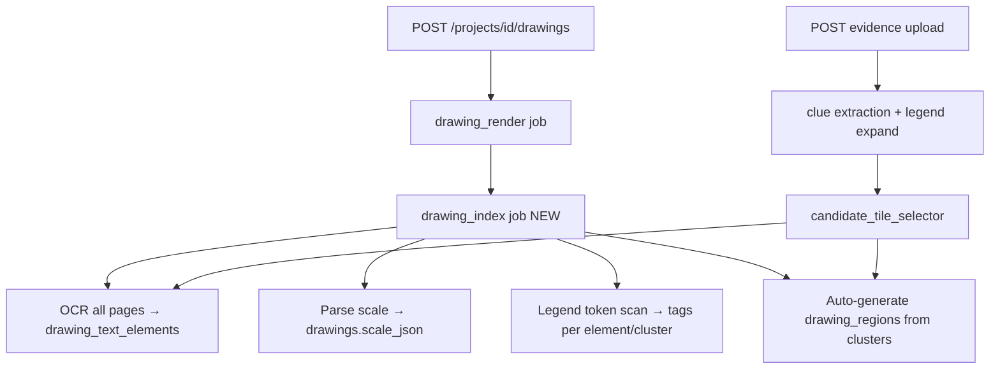

Here is a concrete implementation plan grounded in your codebase today and what failed on project 2 / drawing 661.

---

## Current gap (why upload alone is not enough)

| What exists today | What's missing |
|---|---|
| `POST /drawings` → `Drawing` row + `drawing_render` job (PNG pages) | No OCR/index job on upload |
| `drawing_regions` — manual or `seed_drawing_regions.py` only | **0 regions** on your master → matcher returns nothing |
| `candidate_tile_selector` reads **`drawing_regions` only** (not OCR) | Planned `DrawingTextElement` table **does not exist yet** |
| Legend lookup (`legend_lookup.py`, C0.00 seed) | Only used at **inspection match time**, not at master ingest |
| `MasterDrawingFields` extractor (sheet #, labels, symbols) | Only runs on **evidence** uploads, not master ingest |
| `RegistrationTransform.scale_x/y` | Photo→master alignment only, **not drawing scale (1"=10')** |

**Goal:** On every master drawing upload, automatically build a searchable index (OCR + legend + scale) so later inspection uploads can place without manual region drawing.

---

## Target architecture



Two searchable layers (complementary):

1. **`drawing_text_elements`** — fine-grained OCR tokens (`SS`, `SSMH`, `COLO`) with bboxes (matches your Phase 19 plan).
2. **`drawing_regions`** — auto-generated clusters/tiles with `location_tags` + `inspection_type_tags` (what the matcher uses today).

---

## Phase 0 — Data model & config

### 0a. `drawing_text_elements` table (new)

```python
# models/drawing_text_element.py
class DrawingTextElement(Base):
    id
    master_drawing_id  # FK drawings.id
    page               # 1-based
    text               # "SS", "SSMH", "COLO"
    text_normalized    # lower/strip
    bbox_json          # {x,y,width,height} normalized 0–1
    ocr_confidence
    legend_expansion   # nullable — "SANITARY SEWER" if token matched legend
    legend_codes_json  # nullable — ["SS","SSMH"] if phrase matched
    source             # "native_pdf" | "tesseract" | "openai_vision"
    created_at
```

Indexes: `(master_drawing_id, page)`, GIN/trigram on `text_normalized` if needed later.

### 0b. Scale metadata on `drawings` (extend existing model)

```python
# drawings.meta or dedicated columns:
scale_json = {
    "raw_text": "1\" = 10'",
    "paper_inches_per_real_foot": 0.1,   # 1" on paper = 10' real
    "real_feet_per_paper_inch": 10.0,
    "horizontal": {"numerator": 1, "denominator": 10, "units": "in=ft"},
    "vertical": {...},                   # often same as horizontal
    "confidence": 0.85,
    "source_bbox": [x0,y0,x1,y1],        # title-block location
    "page": 1,
}
page_meta_json = [{
    "page": 1,
    "width_pt": 3024,
    "height_pt": 2160,
    "width_px": 8400,   # from rendition
    "height_px": 6000,
    "rotation": 0,
}]
```

### 0c. Index job status on `drawings`

Reuse `processing_status` or add:

```python
index_status: "pending" | "processing" | "ready" | "failed"
index_error: Text
indexed_at: DateTime
index_stats_json: {"pages": 3, "text_elements": 8420, "regions": 156, "scale_found": true}
```

### 0d. Config (`config.py`)

```python
drawing_index_enabled = True
drawing_index_tile_size_normalized = 0.08   # fallback grid tile ~8% of page
drawing_index_min_cluster_words = 2
drawing_index_ocr_max_pages = 0             # 0 = all
drawing_index_auto_region_mode = "cluster"  # cluster | grid | hybrid
```

---

## Phase 1 — Master drawing index job

### 1a. New job type: `drawing_index`

**Enqueue:** at end of successful `drawing_render` (or from `upload_drawing` after render job is queued — better: **chain inside worker** when render completes).

```
services/drawing_index_jobs.py
  JOB_TYPE = "drawing_index"
  enqueue_drawing_index_job(db, project_id, drawing_id)
  run_drawing_index_job(drawing_id, session) -> IndexResult
  process_drawing_index_job(drawing_id)  # async wrapper
```

**Worker:** add handler in `job_worker.py` alongside `drawing_render` and `inspection_match`.

**Idempotency:** delete/replace existing `drawing_text_elements` + auto-generated regions for that drawing before re-index (keep manually edited regions — tag auto regions with `meta.source = "auto_index"`).

---

## Phase 2 — OCR ingest pipeline

**New module:** `backend/ai/pipelines/master_drawing_indexer.py`

Reuse existing stack:

| Step | Reuse |
|------|--------|
| Load PDF/image | `open_storage_path` + `Drawing.storage_key` |
| Extract positioned words | `extract_document()` from `document_text_extraction.py` |
| OCR | `ocr_engine.py` (same as evidence) |
| Normalize bboxes | `BoundingBox.to_fractional()` |

**Persist:** bulk insert `DrawingTextElement` rows per word/token.

**Page dimensions:** read PDF MediaBox via PyMuPDF; cross-reference `DrawingRendition.width_px/height_px` for pixel↔normalized mapping.

---

## Phase 3 — Scale extraction

**New module:** `backend/ai/pipelines/drawing_scale_parser.py`

### 3a. Regex-first (fast, deterministic)

Scan title-block area (bottom-right 25% of page 1, or full page if needed) for patterns:

```
1" = 10'
1"=10'
1 inch = 10 feet
1:100
SCALE 1/8" = 1'-0"
HORIZ 1"=10'  VERT 1"=10'
```

Output structured `scale_json` with confidence.

### 3b. LLM fallback (optional)

If regex misses, send title-block OCR snippet to a small prompt (same pattern as `document_classifier.py`).

### 3c. Physical size

From PDF:
- `page_width_in = media_box.width / 72`
- `page_height_in = media_box.height / 72`

Store so you can answer: *"this 0.05 normalized bbox is ~X feet on site."*

```python
real_width_ft = normalized_width * page_width_in * real_feet_per_paper_inch
```

---

## Phase 4 — Legend enrichment at index time

**New module:** `backend/services/master_drawing_legend_tagger.py`

For each OCR token or n-gram:

| Token type | Action |
|------------|--------|
| Single token `SS` | `expand_abbreviation(session, "SS", project_id)` → store expansion on element |
| Phrase in cluster `"SANITARY SEWER"` | `find_codes_for_term(...)` → attach codes |
| Unknown token | leave null; optional review queue |

Also run against **seeded C0.00 legend** (`scripts/seed_legend_reference.py`) — call seed on project setup or globally (`project_id=NULL`).

**Output:** each text element and each auto-region gets enriched tags:

```python
location_tags = ["SS", "SANITARY SEWER", "SSMH"]
inspection_type_tags = ["33-Sanitary Sewerage"]
```

---

## Phase 5 — Auto-generate `drawing_regions`

This is what fixes your immediate problem (0 regions).

**New module:** `backend/ai/pipelines/master_drawing_region_builder.py`

### Strategy A — **Spatial clustering** (recommended for site plans)

1. Group `PositionedWord` by page.
2. Cluster by centroid (simple grid bucket or DBSCAN):
   - bucket size ~2–5% of page normalized
3. Each cluster → one `DrawingRegion`:
   - `geometry` = union bbox of words in cluster
   - `label` = top OCR tokens or legend expansion
   - `location_tags` = legend codes + significant tokens (SS, COLO, MLK)
   - `inspection_type_tags` = trade phrases detected in cluster
   - `meta.source = "auto_index"`

### Strategy B — **Fixed grid tiles** (fallback for sparse OCR)

Split each page into e.g. 12×12 grid; each cell with any OCR text becomes a searchable tile. Good for large campus masters like `Master.pdf`.

### Strategy C — **Hybrid** (production)

- Page 1 title block → 1 region (scale, sheet number)
- Legend block if detected → 1 region
- Plan body → grid or cluster tiles

**Filter junk:** skip clusters with only punctuation, single digits, or OCR confidence &lt; 0.5.

---

## Phase 6 — Wire matching to the new index

### 6a. Update `candidate_tile_selector.py`

Priority order:

1. **`drawing_text_elements`** (fine match — "SS-3" on U2.C4.00)
2. **`drawing_regions`** (coarse match — tagged clusters)
3. Merge/deduplicate by bbox overlap

This matches your original Phase 19 design; the comment in the file already says OCR table is the intended source.

### 6b. Pass `project_id` everywhere (partially done)

Ensure `run_inspection_match_job` passes `project_id` into `find_candidate_tiles_from_clues` and `expand_clue_value` (legend expansion at match time).

### 6c. Block or warn on unindexed masters

On evidence upload, if `drawing.index_status != "ready"` or `region_count == 0`:

- Return `index_status: "pending"` in upload response
- Show UI banner: *"Master drawing is still being indexed…"*
- Optionally queue match job with dependency on index job

---

## Phase 7 — API & UI

### Backend

| Endpoint | Purpose |
|----------|---------|
| `GET /drawings/{id}/index-status` | `{status, stats, scale, error}` |
| `POST /drawings/{id}/reindex` | Manual re-run after legend seed update |
| `GET /drawings/{id}/text-elements?page=1&limit=500` | Debug/admin view |
| Extend `GET /drawings/{id}` | include `scale_json`, `index_stats_json` |

### Frontend

| UI | Behavior |
|----|----------|
| Objects page / drawing header | "Indexing…" spinner while `index_status=processing` |
| After index | "842 regions indexed · Scale 1\"=10' · 3 pages" |
| Match alert | Distinguish "index not ready" vs "no match found" |
| Region editor | Show auto regions (read-only or editable); allow human override |

---

## Phase 8 — Tests

| Test | Assert |
|------|--------|
| `test_drawing_scale_parser` | `1"=10'` → `real_feet_per_paper_inch=10` |
| `test_master_drawing_indexer_persists_elements` | OCR words → DB rows with bboxes |
| `test_legend_tagger_ss_expansion` | Token `SS` gets `SANITARY SEWER` |
| `test_region_builder_creates_searchable_regions` | Clusters → `drawing_regions` with tags |
| `test_candidate_selector_uses_text_elements` | Clue `"sanitary sewer"` matches tile with only `SS` |
| `test_upload_drawing_enqueues_index_job` | Upload → render → index chain |
| Integration with fixture PDF | Similar to `test_ucsf_inspection_report_e2e.py` but master-first |

---

## Suggested implementation order (PRs)

| PR | Scope | Unblocks |
|----|--------|----------|
| **PR1** | Schema + migration (`drawing_text_elements`, `drawings.scale_json`, index status) | Storage |
| **PR2** | `drawing_index` job + OCR persist + scale parser | Data in DB |
| **PR3** | Legend tagger + auto `drawing_regions` | Matching on your master |
| **PR4** | `candidate_tile_selector` reads text elements + regions | Inspection placement |
| **PR5** | Upload chain (render → index) + index-status API | Automatic on upload |
| **PR6** | UI status + reindex button | Operator visibility |

---

## Operational notes for your UCSF master

1. **Run legend seed once** (if not already):  
   `python scripts/seed_legend_reference.py`
2. **Re-upload or reindex Master.pdf (661)** after PR5 — expect hundreds/thousands of auto regions, not 0.
3. **Scale** will come from title block OCR; verify on sheet C0.00 / cover if present on the master composite.
4. **Manual region editor** stays useful for correcting bad clusters — auto-index is a bootstrap, not a perfect cartographer.

---

## What not to do in v1

- Don't OCR on the **upload request thread** (your evidence upload already took ~130s with link follow).
- Don't auto-classify the master as an inspection report (separate pipeline from evidence).
- Don't expose match scores or OCR confidence to the frontend (existing Phase 19 rule).
- Don't delete human-drawn regions on reindex — only replace `meta.source=auto_index` rows.

---

I'm in **Ask mode**, so I can't implement this directly. Switch to **Agent mode** and say which PR to start with (I'd recommend **PR1 + PR2** first: schema + index job + OCR persist + scale parser).
