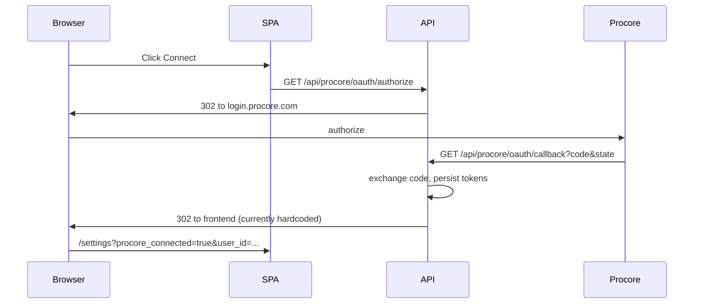

# Procore OAuth production readiness

Technical notes for operating OAuth in production: portal setup, environment variables, deployment patterns, and known gaps in this repository.

## Implementation checklist

- [ ] Add `FRONTEND_PUBLIC_URL` (or `OAUTH_SUCCESS_REDIRECT`) to backend settings; replace hardcoded localhost redirect in `procore_oauth_callback`; document in `backend/.env.example`.
- [ ] Replace `_oauth_states` dict with Redis TTL or signed state verified on callback.
- [ ] Make `CORSMiddleware` `allow_origins` configurable from env for production SPA origin(s).
- [ ] Document same-origin vs split deployment, HTTPS redirect URI, and `PROCORE_ENVIRONMENT=production` for ops.

---

## How the flow works today



Key files: OAuth routes in `backend/api/routes/procore_auth.py`, URLs in `backend/config.py`, client redirect in `client/src/App.tsx` (`window.location.href = "/api/procore/oauth/authorize"`), CORS in `backend/main.py`.

---

## 1. Procore Developer Portal (production app)

1. **Promote sandbox app to production** (if not done): follow Procore’s “promote manifest” flow so you receive **production** OAuth credentials (separate from sandbox client id/secret).
2. In **Manage App → OAuth credentials (production)**:
   - Register **one or more redirect URIs** that match your deployed API exactly (scheme, host, path, no trailing slash mismatch). Example patterns:
     - **Split stack:** `https://api.yourdomain.com/api/procore/oauth/callback`
     - **Same-origin:** `https://app.yourdomain.com/api/procore/oauth/callback` (only if the browser hits that host for `/api`).
3. Confirm **scopes** your integration needs (code uses `read write` in `backend/services/procore_oauth.py`); adjust in portal if your app manifest differs.
4. Store **production** `client_id` and `client_secret` in your secrets manager (not in git).

---

## 2. Application environment (runtime)

Set on the **API** service (e.g. `backend/config.py` / `.env`):

| Variable | Production value |
|----------|------------------|
| `PROCORE_ENVIRONMENT` | `production` (uses `login.procore.com` + `api.procore.com`) |
| `PROCORE_CLIENT_ID` / `PROCORE_CLIENT_SECRET` | Production credentials from portal |
| `PROCORE_REDIRECT_URI` | **Identical** to the URI registered in the portal (HTTPS) |

Add a **public frontend base URL** for the post-OAuth redirect. Today the callback hardcodes localhost:

```python
# backend/api/routes/procore_auth.py (excerpt)
# Redirect to frontend
base = "http://localhost:5173/settings"
qs = f"?procore_connected=true&user_id={procore_user_id}"
if active_company_id is not None:
    qs += f"&company_id={active_company_id}"

return RedirectResponse(url=f"{base}{qs}")
```

**Required code/config change:** introduce something like `FRONTEND_PUBLIC_URL` or `OAUTH_SUCCESS_REDIRECT` (e.g. `https://app.yourdomain.com/settings`) and build `base` from settings instead of a literal.

---

## 3. Deployment shape (choose one)

**Option A – Same origin (simplest for OAuth and cookies)**  
Serve the built SPA and mount `/api` on the **same** HTTPS host (reverse proxy → FastAPI + static from `dist/public` per `vite.config.ts` or CDN rewrites). Then:

- `PROCORE_REDIRECT_URI` uses that same host.
- Relative `/api/...` from the SPA keeps working.
- CORS is less critical (same site).

**Option B – Split API and SPA domains**

- `PROCORE_REDIRECT_URI` must hit the **API** host.
- `FRONTEND_PUBLIC_URL` must be the **SPA** origin for the final redirect.
- Update CORS: `backend/main.py` currently allows only localhost origins; add your production SPA origin(s) via env (e.g. `CORS_ORIGINS` comma-separated) instead of hardcoding.

---

## 4. Multi-instance / reliability (OAuth `state`)

`_oauth_states` in `procore_auth.py` is an **in-process** dict. With more than one API worker or a restart during login, users can see **Invalid state parameter**.

**Production fix (pick one):**

- **Redis-backed state** (`redis_url` exists in settings but is unused for OAuth today): store `state → metadata` with a short TTL, or
- **Signed state** (no storage): embed nonce + expiry in `state` and verify HMAC with a server secret.

Document the choice in `backend/.env.example` once implemented.

---

## 5. HTTPS and Procore rules

- Procore redirect URIs for production should use **HTTPS** on a stable domain (localhost is dev-only).
- Keep **sandbox** and **production** credentials and environments isolated: wrong `PROCORE_ENVIRONMENT` vs credential type causes “unknown client” / token errors.

---

## 6. UX polish (seamless reconnect)

After implementing configurable redirect:

- Optionally **clean the URL** after OAuth (strip `user_id` / `procore_connected` from the query string) so refreshes do not keep sensitive params visible — `client/src/App.tsx` already reads them on load.
- Return a **friendly HTML or redirect** on callback errors instead of a raw 400 when state is invalid (optional).

---

## 7. Security note (beyond OAuth)

The API accepts `user_id` (Procore user id) as a **query parameter** on many routes without session/JWT binding. OAuth being “production ready” does not by itself prevent a caller who knows or guesses ids from invoking endpoints. A follow-on phase is to tie Procore connections to **logged-in app users** (session or JWT) and stop passing raw `user_id` from the client for authorization. Mention this in rollout so expectations are clear.

---

## Suggested implementation order (in repo)

1. Add `FRONTEND_PUBLIC_URL` (or similar) + use it in `procore_oauth_callback`; update `backend/.env.example`.
2. Replace in-memory `_oauth_states` with Redis or signed state.
3. Make CORS origins configurable for split-domain production.
4. If using Option A, enable static mount in `backend/main.py` (currently commented) or document nginx/Caddy config for same-origin.

No need to change the frontend’s `window.location.href = "/api/procore/oauth/authorize"` if production is same-origin; for split domains you may need an absolute API base for that first hop.
